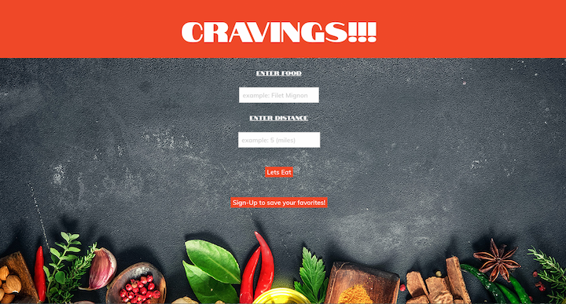

Cravings app allows users to search up a specific menu item and where they can eat it!!

As a food lover I want to look up restaurant that serves a specific food I'm craving.

I also want to know where these restaurants are located so I can make an informed decision of which restaurant to choose.

Install:

Be sure to create a new file called .env on the same level as server.js With code looking like 'PASSWORD= "your SQL password" 
API_KEY = "your api key for XYZ from Rapid API"

run `npm install` from your terminal to install dependecies. 

Click on the link below for an easy access to the application:

Click on the link below for an easy access to the application:

https://projectnumtwo.herokuapp.com/